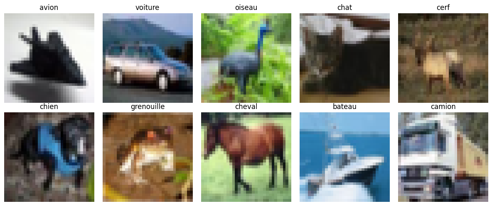
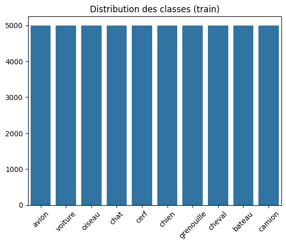
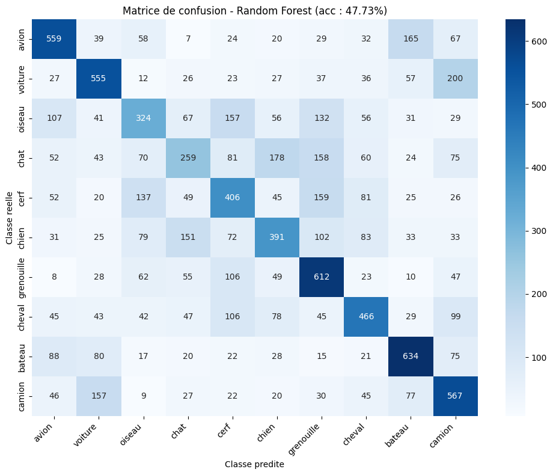
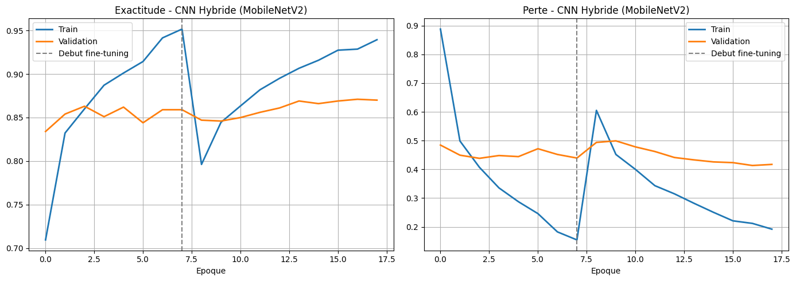
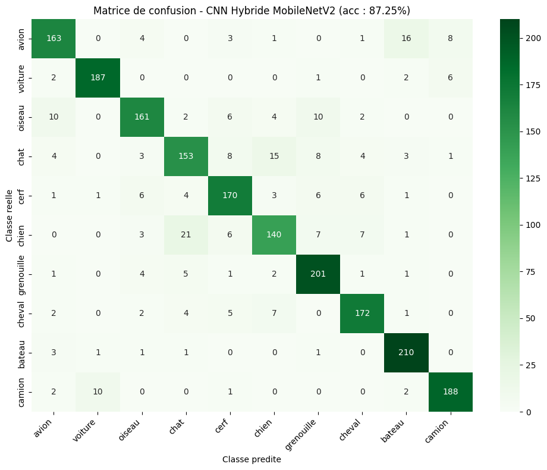

# Rapport — Classification CIFAR-10

**Projet IA02 — Classification non linéaire grâce à l'IA avancée**
**Auteurs :** Yves CHEKOUA, Mohamed Mehdi TRABELSSI — UTT, SN2

## 1. Présentation du dataset

CIFAR-10 contient 60 000 images couleur de 32×32 pixels (3 canaux RGB), réparties en 10 classes parfaitement équilibrées (5 000 images d'entraînement et 1 000 de test par classe) : *avion, voiture, oiseau, chat, cerf, chien, grenouille, cheval, bateau, camion*.





Le dataset étant parfaitement équilibré, aucune pondération de classe n'est nécessaire pour les algorithmes de classification.

## 2. Préparation des données

Deux pipelines de préparation distincts ont été utilisés selon le type de modèle :

**Pour les algorithmes ML classiques (SVM, Régression Logistique, Random Forest)**
- Aplatissement : chaque image 32×32×3 est convertie en un vecteur de 3 072 valeurs
- Normalisation : division par 255 pour ramener les pixels dans l'intervalle [0, 1]
- Réduction de la taille du jeu de recherche d'hyperparamètres à 10 000 images (sur les 50 000 disponibles) pour limiter le temps de calcul du `GridSearchCV` sur CPU

**Pour les CNN**
- Les images conservent leur format 32×32×3, simplement normalisées dans [0, 1]
- Pour le CNN hybride (MobileNetV2), un redimensionnement à 96×96 est appliqué (voir section 4.4)

## 3. Algorithmes de Machine Learning classiques

### 3.1 SVM (noyau RBF)

Recherche d'hyperparamètres par validation croisée (3 folds) sur la grille `C ∈ {0,1 ; 1 ; 10}`, `gamma ∈ {scale ; 0,01}`.

| Métrique | Valeur |
|---|---|
| Exactitude (test) | **47,63 %** |
| Temps d'entraînement (GridSearch) | ≈ 3 994 s |

### 3.2 Régression Logistique

Solveur `saga`, recherche sur `C ∈ {0,01 ; 0,1 ; 1 ; 10}`.

| Métrique | Valeur |
|---|---|
| Exactitude (test) | ≈ 40 % |

### 3.3 Random Forest

Recherche d'hyperparamètres sur 10 000 images (`n_estimators`, `max_depth`, `max_features`), puis entraînement final sur les 50 000 images du jeu d'entraînement complet.



| Métrique | Valeur |
|---|---|
| Exactitude (entraînement) | 99,76 % |
| Exactitude (test) | **47,73 %** |
| Temps d'entraînement | ≈ 639 s |

L'écart important entre les performances en entraînement et en test (99,76 % vs 47,73 %) révèle un **surapprentissage marqué** : le modèle mémorise les exemples d'entraînement sans parvenir à généraliser, les pixels bruts ne fournissant pas de features suffisamment discriminantes.

### Bilan ML classique

Les trois algorithmes plafonnent entre 40 % et 48 % d'exactitude. Cette limitation s'explique par la représentation en pixels bruts aplatis, qui détruit la structure spatiale de l'image — pourtant essentielle à la reconnaissance visuelle. Une convolution est nécessaire pour exploiter cette structure.

## 4. CNN — comparaison de 3 architectures

Les trois architectures partagent le même pipeline d'entraînement (Adam, `EarlyStopping`, `ReduceLROnPlateau`, 15 époques maximum, batch size 64) et ne diffèrent que par leur profondeur et leur régularisation.

### 4.1 CNN Simple (baseline)

```
Conv2D(32) → MaxPooling2D
→ Conv2D(64) → MaxPooling2D
→ Flatten → Dense(64) → Dense(10, softmax)
```

**Exactitude (test) : 70,94 %**

### 4.2 CNN Intermédiaire

Double convolution par bloc pour enrichir l'extraction de features avant chaque réduction de dimension.

```
[Conv2D(32) ×2] → MaxPooling2D
→ [Conv2D(64) ×2] → MaxPooling2D
→ Flatten → Dense(128) → Dense(10, softmax)
```

**Exactitude (test) : 72,50 %**

L'ajout d'une seconde convolution par bloc n'apporte que +1,5 point par rapport au modèle simple : la profondeur seule ne suffit pas à améliorer significativement la généralisation.

### 4.3 CNN Avancé (régularisé)

Ajout de `BatchNormalization` et de `Dropout` croissant (0,2 → 0,3 → 0,4) à chaque étage.

```
[Conv2D(32) + BN + ReLU] ×2 → MaxPool → Dropout(0,2)
→ [Conv2D(64) + BN + ReLU] ×2 → MaxPool → Dropout(0,3)
→ Dense(128) + BN → Dropout(0,4) → Dense(10, softmax)
```

**Exactitude (test) : 81,66 %**

La régularisation apporte un gain de **+9,16 points** par rapport au CNN Intermédiaire, confirmant que le contrôle du surapprentissage est le levier le plus efficace pour les CNN entraînés de zéro sur ce dataset.

### 4.4 CNN Hybride — Transfer Learning MobileNetV2

**Approche en deux phases (méthode *Freeze* puis *Fine-tuning*) :**

- **Phase 1 (Freeze)** : toutes les couches de la base MobileNetV2 pré-entraînée sur ImageNet sont gelées ; seule la tête de classification (`GlobalAveragePooling2D → Dense(128) → Dropout(0,3) → Dense(10)`) est entraînée, avec un taux d'apprentissage `lr = 1×10⁻³`
- **Phase 2 (Fine-tuning)** : les 30 dernières couches de la base sont dégelées et entraînées avec un taux d'apprentissage très faible (`lr = 1×10⁻⁵`) pour affiner les features sans détruire les poids pré-entraînés

**Pourquoi redimensionner les images à 96×96 ?**
MobileNetV2 applique 5 couches de `MaxPooling` à stride 2. Sur des images 32×32, les feature maps s'effondrent à une résolution de 1×1 avant la couche de pooling global, qui ne contient alors plus aucune information spatiale exploitable — ce qui plafonne l'exactitude à environ 49 %. En redimensionnant les images à 96×96, les feature maps conservent une résolution de 3×3, suffisante pour extraire des features pertinentes.





**Exactitude (test) : 87,25 %**

## 5. Comparaison générale

| Modèle | Exactitude (test) | Temps d'entraînement |
|---|---|---|
| SVM (RBF) | 47,63 % | ≈ 3 994 s |
| Régression Logistique | ≈ 40 % | rapide |
| Random Forest | 47,73 % | ≈ 639 s |
| CNN Simple | 70,94 % | quelques minutes |
| CNN Intermédiaire | 72,50 % | quelques minutes |
| CNN Avancé (régularisé) | 81,66 % | quelques minutes |
| **CNN Hybride MobileNetV2** | **87,25 %** | quelques minutes (CPU) |

## 6. Difficultés rencontrées

- **Effondrement des feature maps MobileNetV2** : la première tentative d'utilisation de MobileNetV2 sur des images 32×32 a produit une exactitude de seulement 49 %, proche du hasard pour certaines classes. Le diagnostic a révélé l'effondrement des feature maps à 1×1 après les 5 couches de `MaxPooling` ; la solution a consisté à redimensionner les images à 96×96 avant de les fournir au réseau.
- **Temps de calcul sur CPU** : l'entraînement initial sur le jeu complet (50 000 images, GridSearchCV à grille large) dépassait largement la durée disponible. La taille des jeux de recherche d'hyperparamètres a été réduite à 10 000 images, tout en conservant un entraînement final du Random Forest sur les 50 000 images.
- **Surapprentissage du Random Forest** : l'écart de 52 points entre exactitude d'entraînement et de test a nécessité une investigation pour confirmer qu'il s'agissait bien d'un problème de représentation des données (pixels bruts) plutôt que d'un mauvais réglage des hyperparamètres.

## 7. Conclusion

Sur CIFAR-10, le **Transfer Learning** est l'approche la plus performante et la plus efficace en temps de calcul : MobileNetV2 atteint 87,25 % d'exactitude, soit +5,6 points par rapport au meilleur CNN entraîné de zéro (CNN Avancé, 81,66 %), et près de 40 points au-dessus des algorithmes ML classiques. Ces résultats confirment que la réutilisation de features apprises sur un grand corpus d'images (ImageNet) constitue un avantage déterminant lorsque les données et le temps de calcul disponibles sont limités.
